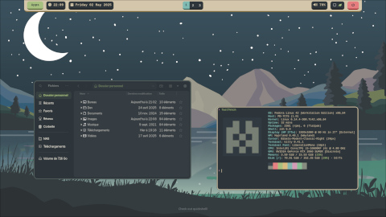

# dotfiles

Automated dotfiles installer with Ansible (featuring my personal set of dotfiles).

```sh
./install.sh
```

## Featuring

### Hyprland desktop configuration with an Everforest theme

<p align="center">
  
</p>

- Window manager: [Hyprland](https://github.com/hyprwm/Hyprland)
- Top bar: [Waybar](https://github.com/Alexays/Waybar)
- App launcher: [Wofi](https://hg.sr.ht/~scoopta/wofi)
- Terminal: [Alacritty](https://github.com/alacritty/alacritty)
- Notification deamon: [Dunst](https://github.com/dunst-project/dunst)

#### Credits

[summer-day-and-night](https://github.com/MathisP75/summer-day-and-night) by [@MathisP75](https://github.com/MathisP75)

## How to use it

Start by forking/cloning this repo.

There is 2 things to edit to make this yours:
* Put your dot files and folders in the "[ansible/roles/common-linux/files/home](ansible/roles/common-linux/files/home)" folder
* Define the desired configurations in the ansible playbooks

Then, just execute the script:
```sh
./install.sh
```

## How it works

The install.sh script will start by installing Ansible.

Then it will run the main playbook to:
- apply a set of configurations depending on the platform
- recursively loop into the "ansible/roles/common-linux/files/home" folder. For each file found, a link will be created in the `$HOME` directory, keeping its subdirectory structure.

Putting a link for configuration files instead of copying them, allows to re-run the dotfiles installer without erasing the locally modified configurations.
