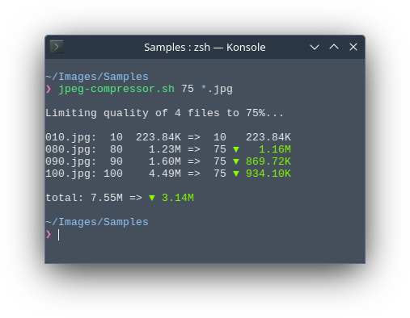

# dotfiles

Automated dotfiles installer with Ansible (featuring my personal set of dotfiles).

```sh
./install.sh
```

## Featuring

## jpeg-compressor.sh
A handy script to compress a bunch of JPEG files at once.
<p align="center">
  
</p>

## tmux theme
<p align="center">
  
</p>

## How to use it

Start by forking/cloning this repo.

There is 2 things to edit to make this yours:
* Put your dot files and folders in the "home" folder
* Define the desired configurations in the ansible playbooks

Then, just execute the script:
```sh
./install.sh
```

## How it works

The install.sh script will start by installing Ansible.

Then it will run the main playbook to:
- apply a set of configurations
- recursively loop into the local "home" folder. For each file found, a link will be created in the `$HOME` directory, keeping its subdirectory structure.
