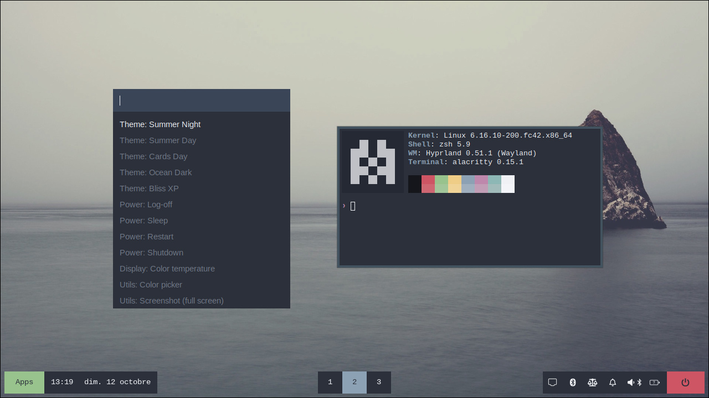
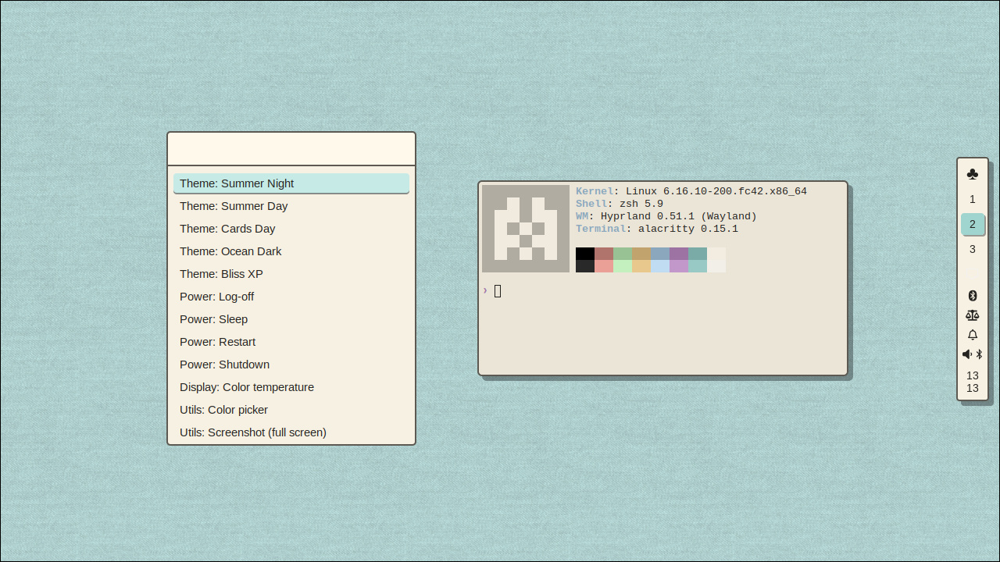
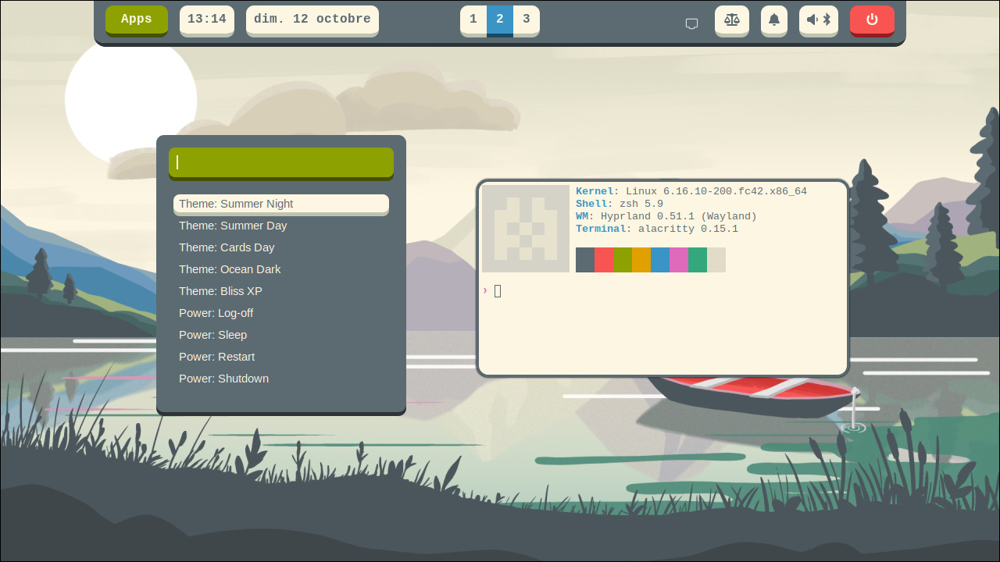
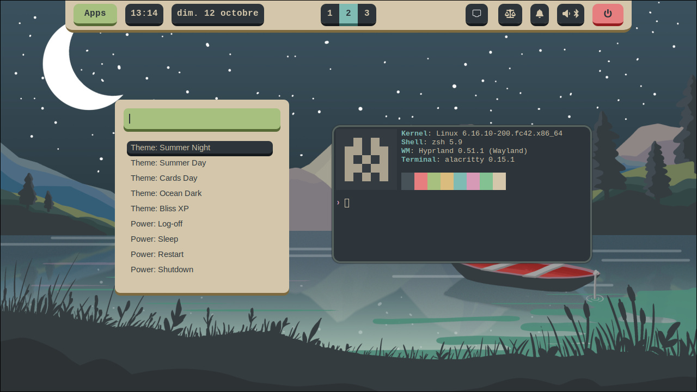
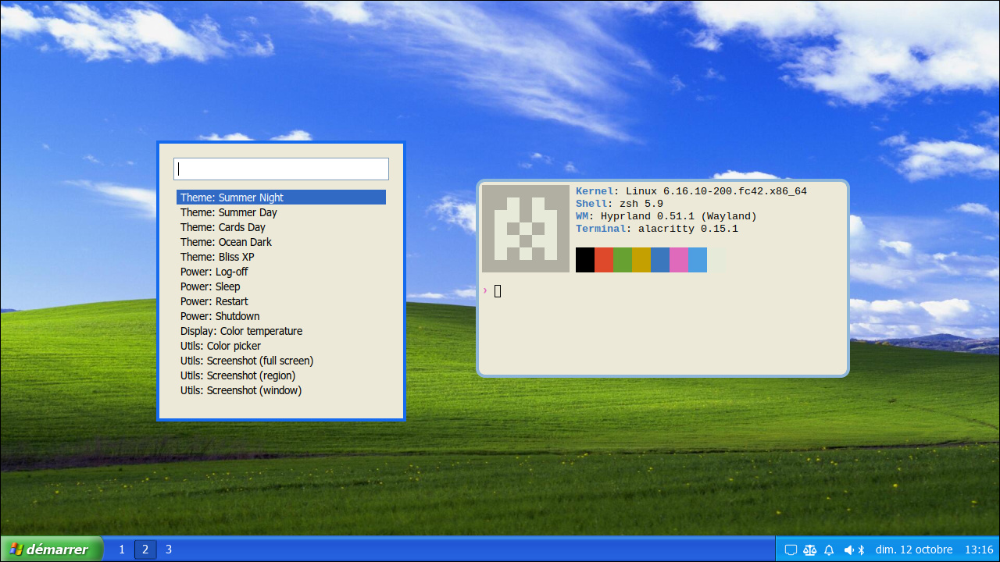
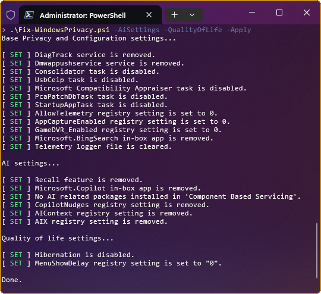

# dotfiles

Automated dotfiles installer with Ansible (featuring my personal set of dotfiles).

```sh
./install.sh
```

## Featuring

### Hyprland desktop configuration with a selection of themes

<p align="center">
  
</p>

- Window manager: [Hyprland](https://github.com/hyprwm/Hyprland)
- Top bar: [Waybar](https://github.com/Alexays/Waybar)
- App launcher: [Rofi](https://davatorium.github.io/rofi/)
- Terminal: [Alacritty](https://github.com/alacritty/alacritty)
- Notification deamon: [Swaync](https://github.com/ErikReider/SwayNotificationCenter)
- Logout menu: [wlogout](https://github.com/ArtsyMacaw/wlogout/)

### Automated theme switcher

All theme files (css, config, etc.) are gathered in a single folder that is dynamically selected via a symbolic link.
This allows to easily change theme and apply it immediately.

```
~/.config/mydesktop
├── current-theme ------------.
└── themes                    |
    ├── bliss-xp              | symlink
    ├── ocean-dark            |
    ├── summer-day <----------'
    ├── summer-night
    └── ...
```

The script [command-palette.sh](ansible/roles/common-linux/files/home/.local/bin/command-palette.sh) Opens a
Rofi menu to select a theme and replaces the symlink ~/.config/mydesktop/current-theme accordingly.
<p align="center">
  
</p>

### Themes
|||
|-|-|
|||
|||
|||


#### Credits

- [summer-day-and-night](https://github.com/MathisP75/summer-day-and-night) by [@MathisP75](https://github.com/MathisP75)
- [everforest](https://github.com/sainnhe/everforest) by [@sainnhe](https://github.com/sainnhe)

## How to use it

Start by forking/cloning this repo.

There is 2 things to edit to make this yours:
* Put your dot files and folders in the "[ansible/roles/common-linux/files/home](ansible/roles/common-linux/files/home)" folder
* Define the desired configurations in the ansible playbooks

Then, just execute the script:
```sh
./install.sh
```

## How it works

The install.sh script will start by installing Ansible.

Then it will run the main playbook to:
- apply a set of configurations depending on the platform
- recursively loop into the "ansible/roles/common-linux/files/home" folder. For each file found, a link will be created in the `$HOME` directory, keeping its subdirectory structure.

Putting a link for configuration files instead of copying them, allows to re-run the dotfiles installer without erasing the locally modified configurations.

# Bonus

## Fix-WindowsPrivacy.ps1

If you really have to use Windows, this disables some privacy invasive features of Windows 11.

```powershell
PS (Admin)> .\Fix-WindowsPrivacy.ps1
```

Please make sure to check what this script performs before running it on a sensitive machine. I decline any responsibility for a broken system after running this.

**Notice**: This may have strange side effects like disabling font smoothing and randomly displayng a solid color wallpaper.

<p align="center">
  
</p>
