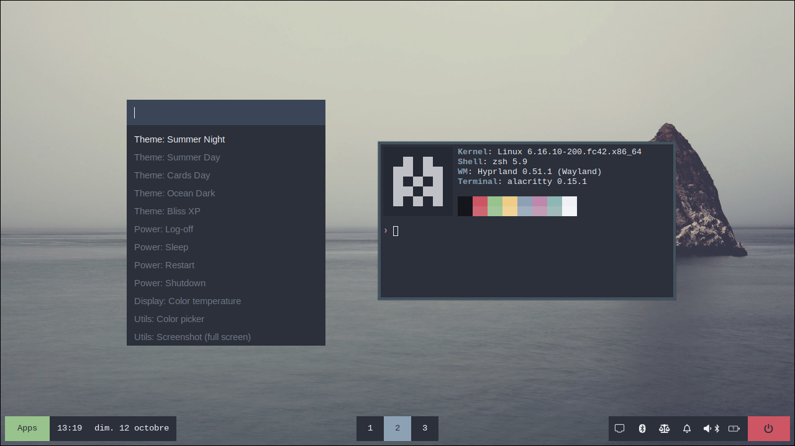
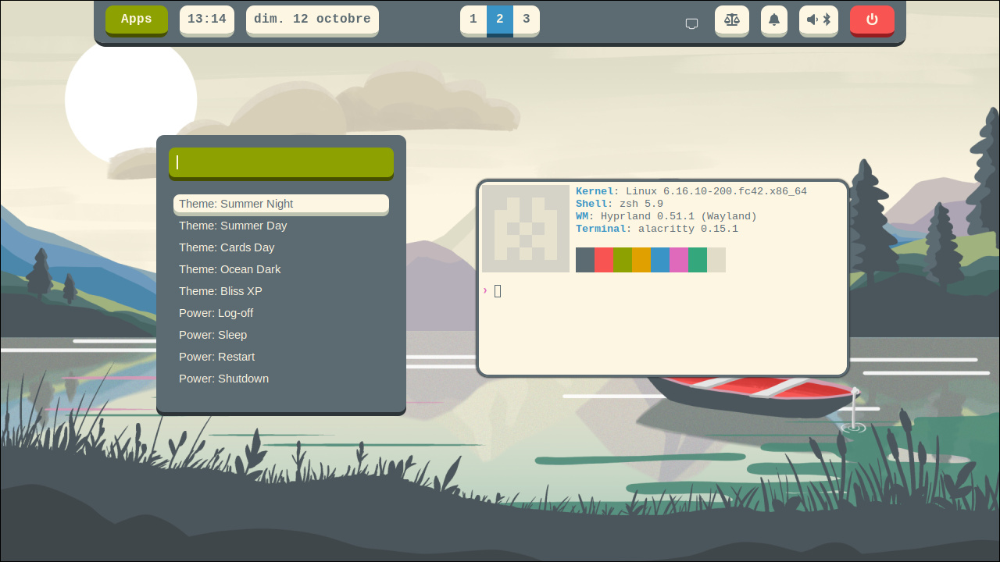
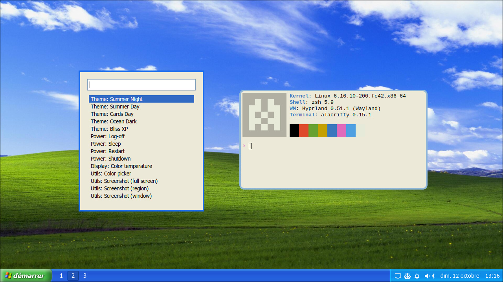

# dotfiles

Automated dotfiles installer with Ansible (featuring my personal set of dotfiles).

Installs a nice Hyprland destop for Fedora or OpenSUSE Tumbleweed. With plenty of treats.

  

  

  

